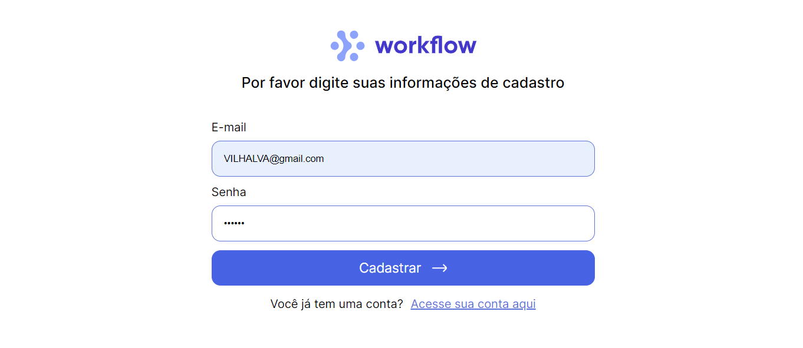
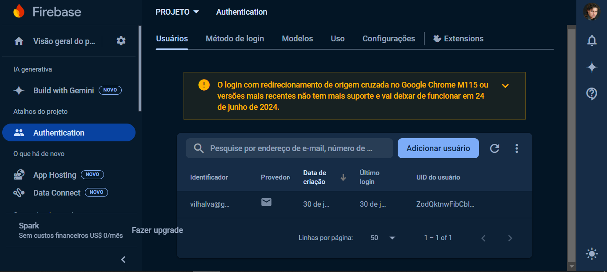

# LOGIN WORKFLOW
👨‍🏫APP DE CADASTRO E LOGIN COM REACT E FIREBASE!

 <br> 
 <br> 

## DESCRIÇÃO:
Este aplicativo React é uma aplicação simples de login e registro usando Firebase para autenticação. Este aplicativo oferece duas funcionalidades principais:

1. **Login de Usuário**: Permite que os usuários façam login usando seu email e senha. Utiliza Firebase para autenticação.
2. **Registro de Usuário**: Permite que novos usuários criem uma conta fornecendo um email e uma senha. Também utiliza Firebase para gerenciar a criação de novos usuários.

## EXECUTANDO O PROJETO:
1. **Criar o app no Firebase**
   1. **Acesse o Firebase Console**:
      - Vá para [Firebase Console](https://console.firebase.google.com/).

   2. **Crie um Novo Projeto**:
      - Clique em "Adicionar projeto".
      - Dê um nome ao seu projeto e siga as instruções para configurá-lo.
      - Quando solicitado, você pode optar por habilitar o Google Analytics para seu projeto (opcional).

   3. **Configuração do Projeto**:
      - Após a criação do projeto, você será redirecionado para o painel do projeto.
      - Clique no ícone de configurações ao lado do nome do projeto e selecione "Configurações do projeto".
      - No menu de configurações, selecione "Suas apps" e clique no ícone do Firebase para web (</>) para criar um novo app web.
      - Dê um nome ao app e clique em "Registrar app".

   4. **Obter Configuração do Firebase**:
      - Após registrar o app, você verá as configurações do Firebase, incluindo o `apiKey`, `authDomain`, `projectId`, etc.
      - Copie essas informações. Você precisará delas para configurar o Firebase na sua aplicação React.

   5. **Configurar Firebase no Projeto**:
      - Adicione a configuração do Firebase no arquivo `./CODIGO/src/services/firebaseConfig.js`, usando as informações copiadas do console do Firebase. O código deve ser semelhante ao seguinte:
      ```javascript
      // src/services/firebaseConfig.js

      import { initializeApp } from "firebase/app";
      import { getAuth } from "firebase/auth";

      const firebaseConfig = {
         apiKey: "SUA_API_KEY",
         authDomain: "SEU_AUTH_DOMAIN",
         projectId: "SEU_PROJECT_ID",
         storageBucket: "SEU_STORAGE_BUCKET",
         messagingSenderId: "SEU_MESSAGING_SENDER_ID",
         appId: "SEU_APP_ID",
      };

      // Initialize Firebase
      const app = initializeApp(firebaseConfig);
      export const auth = getAuth(app);
      ```

2. **Instalando as Dependências:**
   - Para instalar as dependências listadas no arquivo "package.json", você pode usar o comando `npm install` no terminal. Certifique-se de estar no diretório `CODIGO/`, e execute o seguinte comando:
   ```bash
   npm install
   ```

3. **Executando o Aplicativo:**
   - Para iniciar o servidor, abra o terminal e execute o seguinte comando:
   ```bash
   npm run dev
   ```

   - Acesse o aplicativo no navegador visitando [http://localhost:5173/](http://localhost:5173/).

4. **Interagindo com o Aplicativo:**
   1. **Página de Login**:
      - Acesse a página de login.
      - Insira seu email e senha nos campos fornecidos.
      - Clique no botão "Entrar".
      - Se o login for bem-sucedido, você será autenticado e logado no aplicativo.

   2. **Página de Registro**:
      - Acesse a página de registro.
      - Insira seu email e senha nos campos fornecidos.
      - Clique no botão "Cadastrar".
      - Se o registro for bem-sucedido, sua conta será criada e você poderá fazer login com as credenciais fornecidas.

## NÃO SABE?
- Entendemos que para manipular arquivos em `HTML`, `CSS` e outras linguagens relacionadas, é necessário possuir conhecimento nessas áreas. Para auxiliar nesse aprendizado, oferecemos cursos gratuitos disponíveis:
* [CURSO DE HTML E CSS](https://github.com/VILHALVA/CURSO-DE-HTML-E-CSS)
* [CURSO DE JAVASCRIPT](https://github.com/VILHALVA/CURSO-DE-JAVASCRIPT)
* [CURSO DE NODEJS](https://github.com/VILHALVA/CURSO-DE-NODEJS)
* [CURSO DE REACT](https://github.com/VILHALVA/CURSO-DE-REACT)
* [CONFIRA MAIS CURSOS](https://github.com/VILHALVA?tab=repositories&q=+topic:CURSO)

## CREDITOS:
- [PROJETO CRIADO PELO "Rodrigo322"](https://github.com/Rodrigo322/react-login)
- [VEJA O VIDEO DESSE PROJETO](https://youtu.be/LI0YcHMu9P4?si=maGt-CWPzz2crnvp)
- [PROJETO EDITADO PELO VILHALVA](https://github.com/VILHALVA)


